# RepositorioCodigo — David Vicente Hernández

Scripts y pipelines de análisis de datos aplicados al fútbol. Desarrollados durante el Máster en Big Data e Inteligencia Artificial Aplicado al Deporte (Unisport Management School) y el curso Objetivo Analista de Datos 360.

## Tecnologías

Python · Power BI · pandas · matplotlib · mplsoccer · statsbombpy · scikit-learn · Playwright · NumPy · SciPy

---

## Proyectos

### Match Report — Pipeline Completo

19 scripts que generan un informe de partido completo a partir de datos de WhoScored: scraping, cálculo de xT, redes de pases, mapa de tiros, bloque defensivo, momentum, rendimiento de portero y estadísticas individuales.

| | |
|---|---|
| 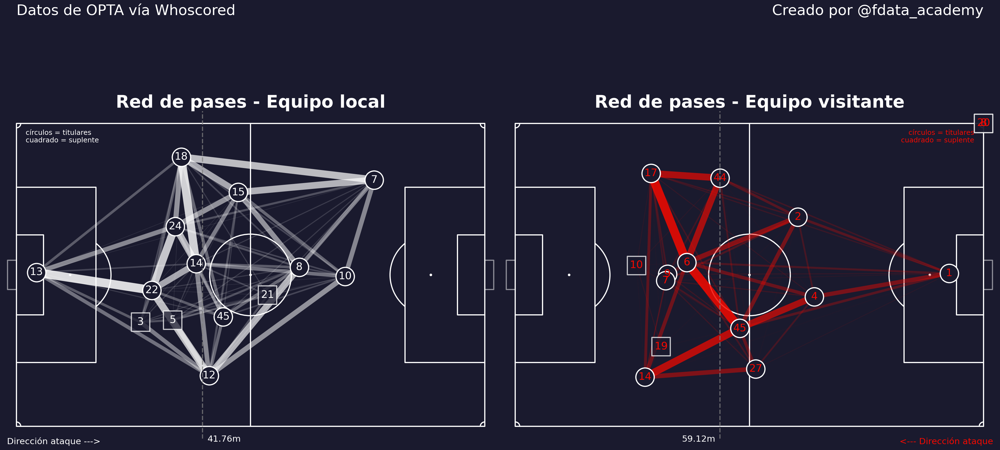 | 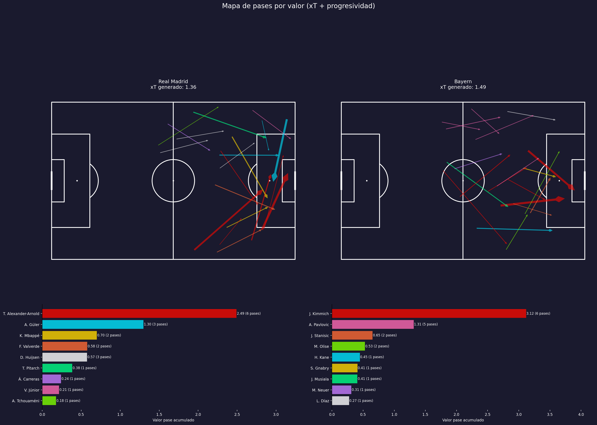 |
| 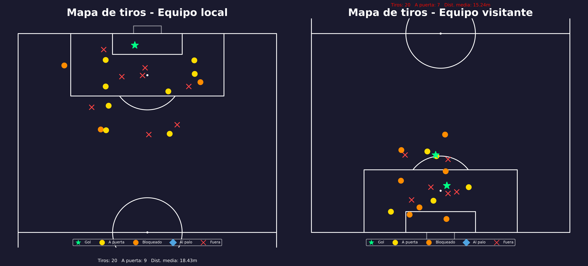 | 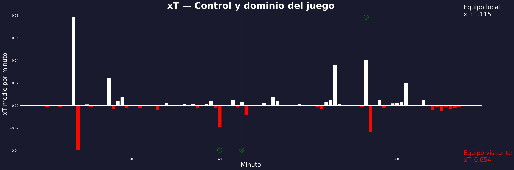 |

---

### Match Report Ofensivo

9 scripts especializados en la fase ofensiva: secuencias de posesión larga, switches de flanco, zonas de recepción, dominio posicional y conexiones entre jugadores.

| | |
|---|---|
| 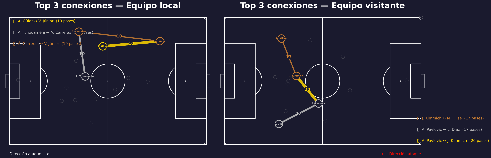 | 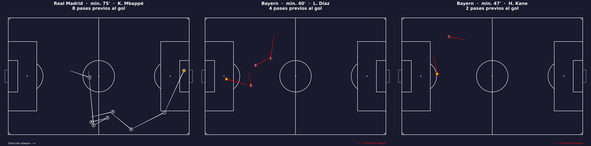 |

---

### Match Report Defensivo

9 scripts para el análisis defensivo: zonas de pérdida y recuperación, transiciones defensivas, duelos, red defensiva y ocasiones concedidas.

| | |
|---|---|
| 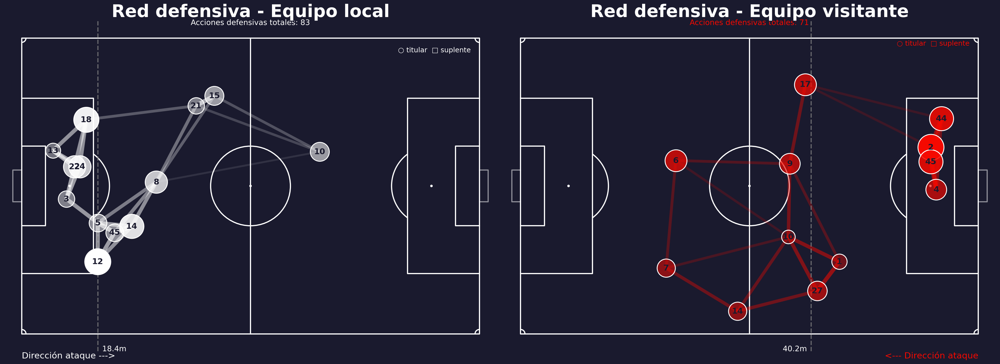 | 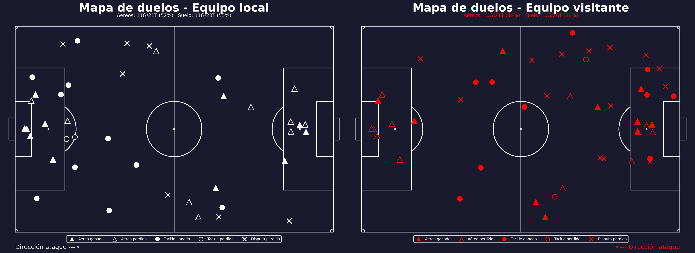 |

---

### Pipeline Jugadores — Módulo 2 Unisport

Pipeline completo de datos de jugadores: limpieza, exploración, contextualización por minutos jugados y modelo ML de predicción de participación. Dashboard interactivo en Power BI.

| | |
|---|---|
| [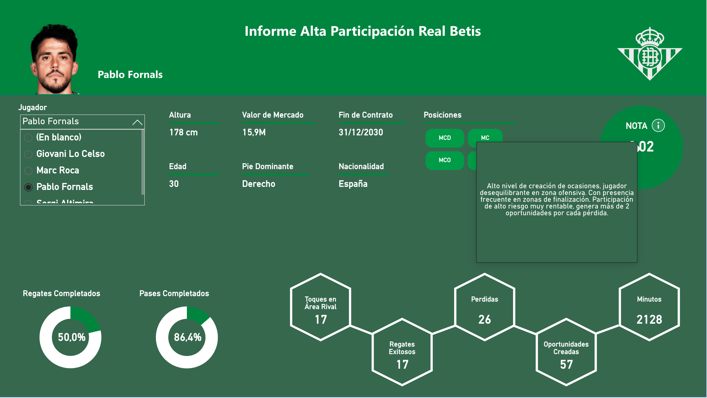](https://app.powerbi.com/view?r=eyJrIjoiY2MzYjQyNDUtZDQ0Zi00YmRhLTllODctOWQwZDU4MjFiM2RjIiwidCI6IjMxNTI1NWE3LTk2NDMtNDYyYy04MGRkLTRjODk1NTgwZDg0NSIsImMiOjh9) | [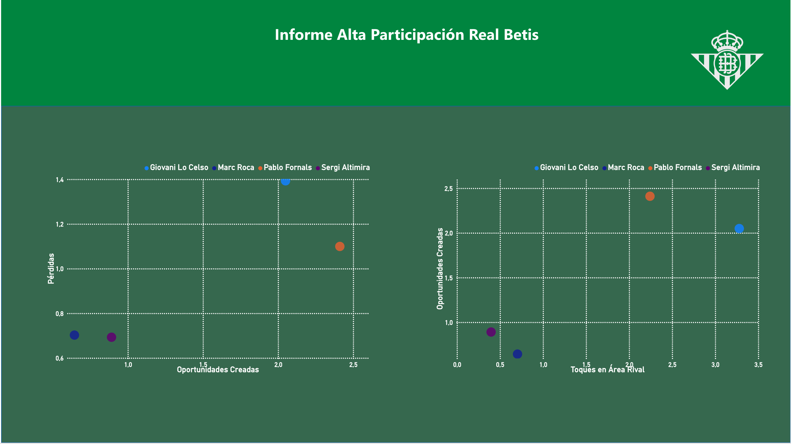](https://app.powerbi.com/view?r=eyJrIjoiY2MzYjQyNDUtZDQ0Zi00YmRhLTllODctOWQwZDU4MjFiM2RjIiwidCI6IjMxNTI1NWE3LTk2NDMtNDYyYy04MGRkLTRjODk1NTgwZDg0NSIsImMiOjh9) |

> Haz clic en las imágenes para abrir el dashboard interactivo

---

### Pipeline Defensas Sub-23 — Eurocopa 2024

Pipeline con datos open-data de StatsBomb: generación de métricas, filtro sub-23, enriquecimiento con edad via API y análisis estadístico descriptivo. Dashboard interactivo en Power BI.

| | |
|---|---|
| [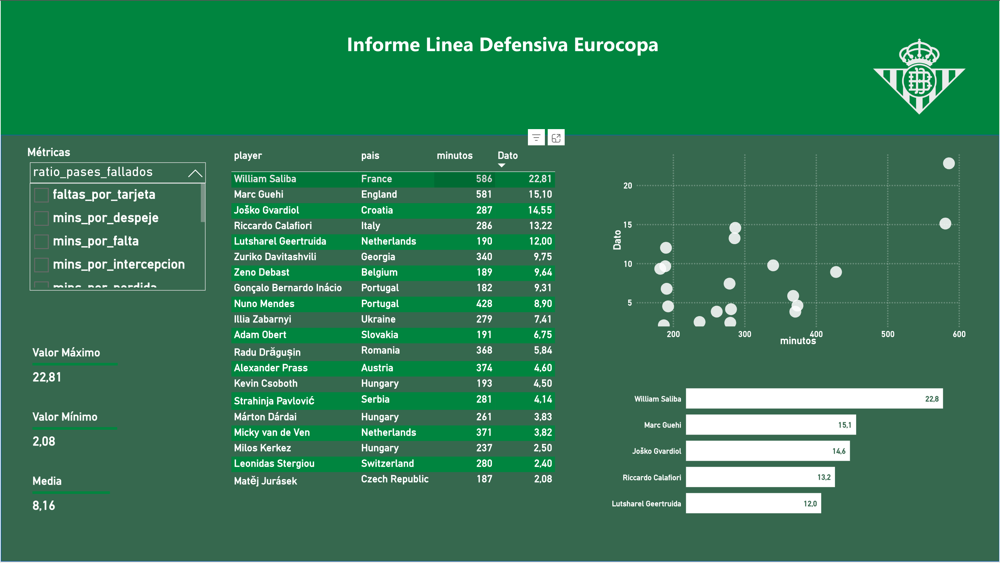](https://app.powerbi.com/view?r=eyJrIjoiZDMyZDc1NWItYjkxMC00OTViLWFlYjYtZDk1YThlNGY2MDkxIiwidCI6IjMxNTI1NWE3LTk2NDMtNDYyYy04MGRkLTRjODk1NTgwZDg0NSIsImMiOjh9) | [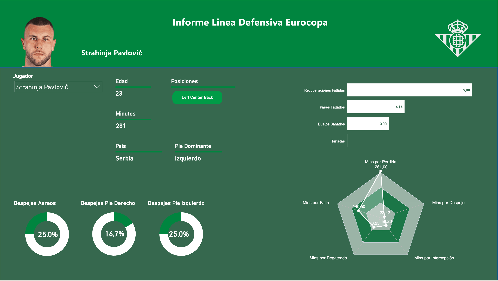](https://app.powerbi.com/view?r=eyJrIjoiZDMyZDc1NWItYjkxMC00OTViLWFlYjYtZDk1YThlNGY2MDkxIiwidCI6IjMxNTI1NWE3LTk2NDMtNDYyYy04MGRkLTRjODk1NTgwZDg0NSIsImMiOjh9) |

> Haz clic en las imágenes para abrir el dashboard interactivo

---

### Módulo 4 Unisport

Scripts del caso práctico del Módulo 4: dashboard deportivo, segmentación de fans, análisis de sentimiento y modelo táctico.

---

## Fuentes de datos

StatsBomb Open Data · WhoScored · Understat · FBref · football-data.org API
