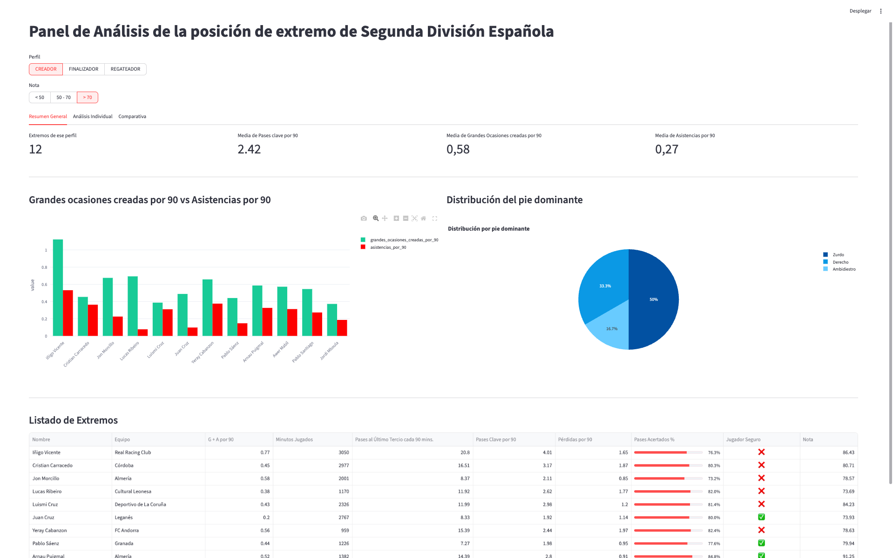
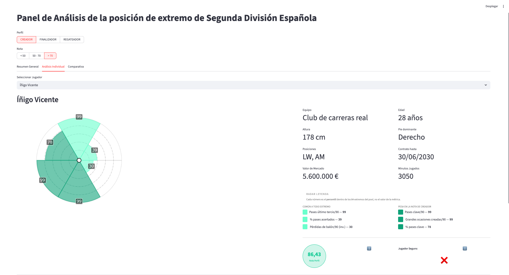
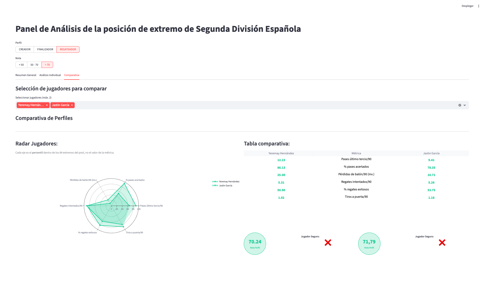
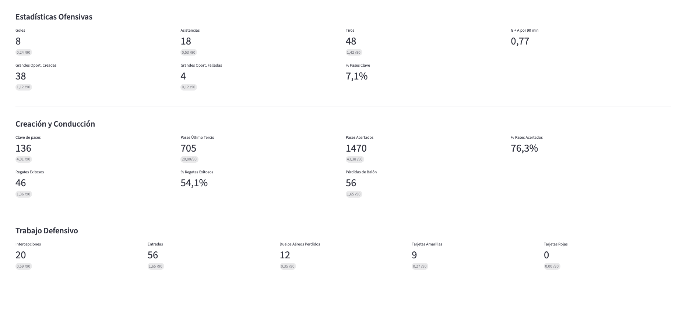
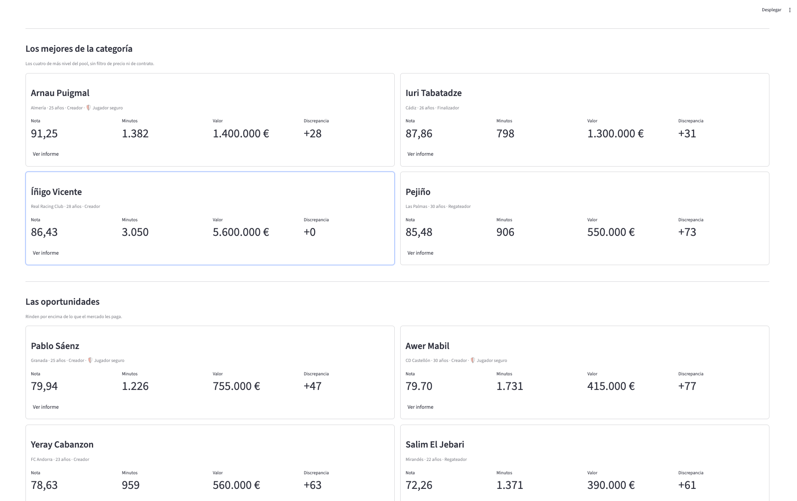
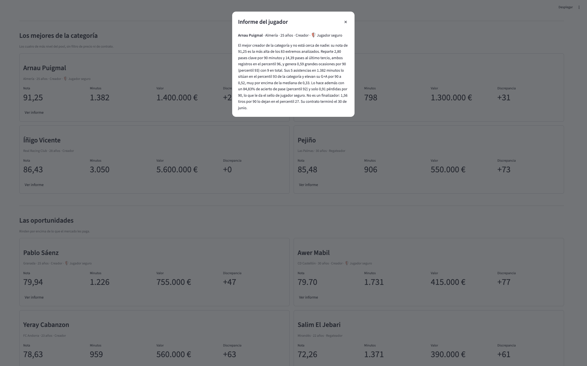

# RepositorioCodigo — David Vicente Hernández

Scripts y pipelines de análisis de datos aplicados al fútbol. Desarrollados durante el Máster en Big Data e Inteligencia Artificial Aplicado al Deporte (Unisport Management School) y el curso Objetivo Analista de Datos 360.

## Tecnologías

Python · Streamlit · Docker · Power BI · pandas · matplotlib · mplsoccer · statsbombpy · scikit-learn · Playwright · NumPy · SciPy

---

## Proyectos

### Match Report — Pipeline Completo

19 scripts que generan un informe de partido completo a partir de datos de WhoScored: scraping, cálculo de xT, redes de pases, mapa de tiros, bloque defensivo, momentum, rendimiento de portero y estadísticas individuales.

| | |
|---|---|
|  |  |
|  |  |

---

### Match Report Ofensivo

9 scripts especializados en la fase ofensiva: secuencias de posesión larga, switches de flanco, zonas de recepción, dominio posicional y conexiones entre jugadores.

| | |
|---|---|
|  |  |

---

### Match Report Defensivo

9 scripts para el análisis defensivo: zonas de pérdida y recuperación, transiciones defensivas, duelos, red defensiva y ocasiones concedidas.

| | |
|---|---|
|  |  |

---

### Informe Alta Participación Real Betis

Pipeline completo de datos de jugadores: limpieza, exploración, contextualización por minutos jugados y modelo ML de predicción de participación. Dashboard interactivo en Power BI.

| | |
|---|---|
|  |  |

> 🔗 <a href="https://app.powerbi.com/view?r=eyJrIjoiZDMyZDc1NWItYjkxMC00OTViLWFlYjYtZDk1YThlNGY2MDkxIiwidCI6IjMxNTI1NWE3LTk2NDMtNDYyYy04MGRkLTRjODk1NTgwZDg0NSIsImMiOjh9" target="_blank">Ver informe completo</a>

---

### Informe Defensas Sub-23 Eurocopa 2024

Pipeline con datos open-data de StatsBomb: generación de métricas, filtro sub-23, enriquecimiento con edad via API y análisis estadístico descriptivo. Dashboard interactivo en Power BI.

| | |
|---|---|
|  |  |

> 🔗 <a href="https://app.powerbi.com/view?r=eyJrIjoiY2MzYjQyNDUtZDQ0Zi00YmRhLTllODctOWQwZDU4MjFiM2RjIiwidCI6IjMxNTI1NWE3LTk2NDMtNDYyYy04MGRkLTRjODk1NTgwZDg0NSIsImMiOjh9" target="_blank">Ver informe completo</a>

---

### Scouting Dashboard Segunda División

Análisis de la posición de extremo en Segunda División española: extracción de métricas vía Sofascore API y pipeline de tres scripts (limpieza, contextualización y filtrado por muestra, clasificación por perfiles). Cada extremo recibe tres notas de 0 a 100 —regateador, finalizador y creador— construidas como índices de percentiles con pesos declarados que suman 100, más un sello de seguridad en el pase. Dashboard Streamlit con radares de seis ejes por perfil, comparativa entre jugadores y explicación en pantalla de cómo se calcula cada nota. **Cierra en un apartado de recomendaciones**: ocho extremos con su informe, cuatro elegidos por nivel y cuatro por estar infravalorados respecto a lo que rinden. Desplegado en producción con Docker en un VPS.

| | |
|---|---|
|  |  |
|  |  |
|  |  |

> 🔗 <a href="https://scouting.davidvh.com" target="_blank">Ver dashboard en vivo</a>

---

## Fuentes de datos

StatsBomb Open Data · WhoScored · Sofascore API · Understat · FBref · football-data.org API
